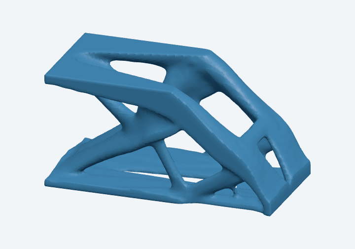
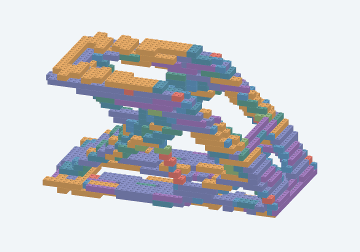

# TopoLegOpt

TopoLegOpt turns a cubic-voxel topology and a collection of rectangular bricks
into an inventory-constrained assembly proposal. It chooses a scale,
fits individual bricks, checks their stud connections and symmetry, and displays
the result with a step-by-step build sequence.

**This is not a research project**. A successful result
passes explicit geometric checks; it is not a proof of maximum scale, optimal
packing, mechanical strength, or assembly without temporary supports.

- [Detailed algorithm and equations](docs/ALGORITHM.md)
- [NPZ input specification and exporter](docs/NPZ_SPEC.md)
- [Portable example topology](examples/README.md)
- [Development and hosting](docs/DEVELOPMENT.md)

## Demo: uploaded cantilever

The uploaded full cantilever has `60 × 60 × 120` cubic source voxels and a
nominal volume fraction of 0.20. Both views below make one complete **360° turn
around vertical Y**, with matching scale, camera settings, and timing.

| Topology · density isosurface at 0.5 | Brick assembly · 525 pieces |
| --- | --- |
|  |  |

This run uses the included **1,000-piece demo inventory**, Y up, no mirroring,
automatic symmetry, and a **500-piece cap with 5% allowance**. The result uses
525 structural bricks, achieves **66.8% shape IoU** and **80.3% target coverage**,
and passes the independent assembly and sequence checks. It preserves X
reflection symmetry with 25 structural bricks centered across the symmetry
plane. The sequence identifies **71 placements needing temporary support**;
those supports are not included in the piece count.

The topology animation shows an interpolated density surface; fit metrics use
the thresholded cubic-cell target. Brick colors identify part sizes. These are
geometry-based renders, not a physical strength demonstration.

[Try the NPZ](examples/cantilever/topology.npz) ·
[Demo inventory](examples/cantilever/inventory.json) ·
[Assembly and sequence JSON](examples/cantilever/assembly.json) ·
[Settings, source image, and reproduction instructions](examples/cantilever/README.md)

## Run locally

Use **Python 3.12** and **Node.js 18 or later** with npm. The pinned dependencies
are tested with Python 3.12; other Python versions are not part of the current
verification. Clone the repository, then create an isolated environment:

```bash
git clone https://github.com/champkt/TopoLegOpt.git
cd TopoLegOpt/brick-planner
python3.12 -m venv .venv
.venv/bin/python -m pip install -r requirements.txt
npm ci
npm run start:local
```

Open <http://localhost:5173>. `npm run start:local` builds the browser application
and documentation, then serves both and the Python API from one origin. Stop it
with Ctrl+C. On systems without Python's venv support, install the corresponding
system package before creating the environment.

For access from another device on your trusted network, use `npm start`, which
binds to `0.0.0.0:5173`, and open `http://YOUR_SERVER_ADDRESS:5173`. This is a
single-user application without authentication. See the
[hosting notes](docs/DEVELOPMENT.md#hosting) before exposing it publicly.
All browser code is bundled locally; no CDN or external service is needed to
use the running planner.

## Use the planner

1. **Brick inventory:** enter quantities for the nine supported sizes and export
   JSON for a portable backup. Every brick is one layer high; rotations share
   the same stock. The 1×1 brick is reserved for details.
2. **Topology:** upload an NPZ, select the density array, threshold, and up axis.
   Keep mirroring off for a complete model. Mirroring explicitly reconstructs
   a full shape from a saved half; it is different from enforcing symmetric
   brick placement.
3. **Assembly:** optionally enter an approximate piece cap and generate a plan.
   Inspect the final brick preview, fit metrics, stock usage, symmetry checks,
   and support notes. Step through the build sequence or export its JSON.

The catalog is `1x1`, `2x1`, `4x1`, `6x1`, `2x2`, `2x3`, `2x4`, `2x6`, and `2x8`.
These dimensions count studs. A stud spacing is **5 relative units** and a brick
layer is **6 relative units**. They are proportions, not millimeters or source
voxel dimensions. Colors in the preview identify sizes and are not inventory
constraints.

Inventory saves in localStorage; the topology saves in IndexedDB; uploads and
job results are also stored in `brick-planner/.local/` on the server. Browser
storage belongs to the current browser, host, and port. Export backups before
switching devices or origins. The refactored app preserves the existing storage
keys.

## Bring your own topology

The recommended input is one array named `density`, shaped `(X, Y, Z)`, with
finite values in `[0, 1]`, saved as C-contiguous little-endian float32. Each
source cell must be a **cube**. There is no required physical scale, filename,
mesh, or application-specific metadata.

```python
import numpy as np

# rho is your three-dimensional density field in X, Y, Z order.
rho = np.asarray(rho)
if rho.ndim != 3 or any(length == 0 for length in rho.shape):
    raise ValueError("Expected a nonempty 3D array in X, Y, Z order")
if rho.dtype.kind not in "biuf":
    raise ValueError("Expected real numeric or boolean densities")
if not np.isfinite(rho).all() or rho.min() < 0 or rho.max() > 1:
    raise ValueError("Densities must be finite and between 0 and 1")
np.savez_compressed("topology.npz", density=np.ascontiguousarray(rho, dtype="<f4"))
```

By default, `density >= 0.5` is solid and Y is vertical. Resample anisotropic
source data into cubic cells before export; spacing, affine transforms, and
axis names in NPZ metadata are not applied by the planner. The
[complete specification](docs/NPZ_SPEC.md) covers supported alternatives,
endianness, storage order, mirroring, value checks, and size limits.

A complete synthetic bridge is included at [examples/bridge.npz](examples/bridge.npz).
It uses Y up, threshold 0.5, and **no mirroring**. Regenerate it from the repository
root with:

```bash
brick-planner/.venv/bin/python examples/create_topology.py --output /tmp/bridge.npz
```

## How scale, fitting, and planning work

The full method is documented in [ALGORITHM.md](docs/ALGORITHM.md), including
notation, exact formulas, thresholds, priorities, stopping rules, and code
references. The essential decisions are:

1. **Define the target.** Threshold the source into solid and empty cubic cells,
   apply any requested half-model reflection, then rotate the chosen up axis
   into build Y without changing handedness. Automatic symmetry compares the
   target with its reflection about each centered axis plane; a reflected voxel
   IoU of at least 0.995 triggers an exact brick-placement symmetry constraint.
2. **Estimate a useful scale from stock.** Let `V` be the stud-layer volume of
   the largest available structural pieces up to the nominal piece budget, and
   `N` the solid source-voxel count. The initial scale is
   `s0 = (1.2 V / N)^(1/3)`. At scale `s`, a cubic source voxel has edge `5s`,
   while a stud-layer cell has volume `5 × 6 × 5 = 150`. Eight empirical scale
   factors around `s0` are considered subject to size and time limits. The
   search does not optimize all possible scales, offsets, or orientations.
3. **Fit the target to a brick lattice.** Integrate source-voxel overlap with
   each lattice cell to obtain its fractional target occupancy. This preserves
   cubic source proportions while accounting for the taller brick layer.
   Summed-area tables accelerate rectangular footprint scoring. Required
   symmetry groups contain each reflected placement and consume stock for
   every physical brick in the group.
4. **Pack a structural backbone.** A greedy priority queue grows placements
   through adjacent-layer stud contacts. It tries a small number of seeds;
   some search candidates can remain disconnected and are rejected later.
   Same-layer side contact contributes no connection. After structural growth,
   1×1 details may attach directly to the backbone, up to 10% of its brick count.
5. **Validate and select.** Independent checks verify catalog geometry, bounds,
   collisions, stock, budget, full and structural-only connectivity, exact
   reflected placements, and centered structural bricks crossing each required
   symmetry plane. Valid candidates are ranked by
   `0.48 × shape IoU + 0.20 × target coverage + 0.32 × structural piece utilization`.
   Those weights are an empirical policy; maximizing brick count and shape
   agreement can conflict. There is no guarantee of using all available stock.
6. **Produce the sequence.** Order bricks by layer and then horizontal coordinates,
   and identify elevated placements
   needing temporary support. Independently check completeness and unobstructed
   vertical insertion of idealized rectangular bodies. The final assembly can
   be connected even when early base sections must be positioned separately.

A cap of 500 with the default 5% allowance permits at most **525 total permanent
pieces**, including details, and never more than stock. It is an approximate
ceiling with no minimum promised count. A blank cap uses the available inventory;
allowance can be changed from 0% to 20%.

## What the result does and does not establish

Connected means at least one aligned stud cell overlaps between bricks in
consecutive layers. Side contact is not counted. Required symmetry includes
actual centered structural bricks crossing the symmetry planes, rather than
only mirrored pieces meeting at a seam. Removing all 1×1 details must leave a
connected structural graph.

These checks do not simulate clutch force, strength, tipping, hand access,
material deformation, or the space occupied by real studs and internal tubes.
The sequence assumes vertical insertion and may need temporary supports that
are **not included in the permanent inventory**. A failed search means this
bounded heuristic found no valid candidate; it does not prove infeasibility.
The solver does not preserve topology-optimization compliance or load paths.

Current application limits include 128 MiB uploads, 32 million selected source
voxels, 5,000 permitted pieces per job, and two concurrent jobs. See the input
specification and method for the additional memory, grid, and timeout limits.

## Verification and experiments

From `brick-planner/`:

```bash
npm run build
npm test
npm run test:python
.venv/bin/python scripts/experiment.py
```

Tests cover format compatibility, inventory behavior, asymmetric coordinate
rotations, cap boundaries, real stud connections, center crossings, structural
connectivity, obstructed insertion, and API behavior. GitHub Actions runs the
build, tests, and portable example experiment from the published files.

The default experiment uses the included bridge and an explicitly labeled
synthetic inventory, writes to ignored `.local/experiments/`, and never changes
browser data. [EXPERIMENTS.md](brick-planner/EXPERIMENTS.md) separates this
reproducible demonstration from earlier measurements on an external topology.
[Documentation review notes](docs/REVIEW.md) record the two adversarial review
rounds and the resulting corrections. These engineering reviews are not
external scientific peer review or evidence of mechanical performance.

## Repository layout

```text
docs/                         Algorithm, input contract, development, citations
examples/                     Portable topology and NumPy generator
brick-planner/
  backend/                    Input validation, solver, independent checks, API
  src/                        Authored browser modules and NPZ worker
  web/                        Authored HTML and styles
  scripts/                    Build and reproducible experiment commands
  tests/                      JavaScript and Python regression tests
  experiments/                Labeled test inventory and historical summaries
  dist/                       Generated site, ignored by Git
  .local/                     Private uploads and job output, ignored by Git
.github/workflows/ci.yml       Build and regression checks
```

The planner has no runtime dependency on the separate `MBB_1x1x2` or
`pyFANTOM_refactor` research directories. Those directories are excluded from
publication; the explicitly supplied cantilever demo assets are copied into
`examples/cantilever/` with provenance.

## Method references and library credits

The combined scale search and placement priorities are this project's heuristic.
Established building blocks include Franklin C. Crow's summed-area tables
([1984](https://doi.org/10.1145/800031.808600)), Paul Jaccard's overlap coefficient
([1901](https://doi.org/10.5169/seals-266450)), and heap-based priority queues
implemented by Python's `heapq`. The method document gives original citations,
explains their precise roles, and provides [BibTeX](docs/references.bib).

Scientific computation uses **NumPy** (Harris et al.,
[2020](https://doi.org/10.1038/s41586-020-2649-2)) and **SciPy** (Virtanen et al.,
[2020](https://doi.org/10.1038/s41592-019-0686-2)). The application uses
**Three.js** (Ricardo Cabello and contributors), **fflate** (Arjun Barrett),
**FastAPI** (Sebastián Ramírez), and **Uvicorn** (Tom Christie and contributors).
Build tools are **esbuild** (Evan Wallace) and **Marked** (Christopher Jeffrey and
contributors). See the separate
[library credits section](docs/ALGORITHM.md#libraries-and-their-roles) for roles,
primary project links, and complete citation context. Exact versions are pinned
in the Python requirements and npm lockfile.

## License

A project license has not yet been selected. No license for TopoLegOpt is granted
by this repository at present. Third-party dependencies retain their own
licenses; bundled JavaScript preserves available dependency license notices.
