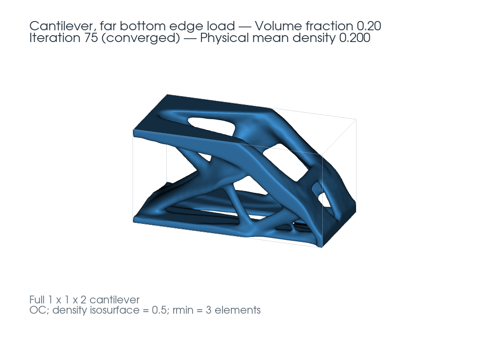

# Uploaded cantilever demo

This demo uses the uploaded full cantilever topology at nominal volume fraction
0.20, filter radius three source elements, and iteration 75. The original saved
field contains `(60, 60, 120)` cubic cells. It is already the complete model.

| Source topology · density 0.5 isosurface | Planned assembly · 525 bricks |
| --- | --- |
|  |  |

Each GIF has 90 views at four-degree intervals. Each frame lasts 80 ms, giving a
7.2-second loop. Both use an orthographic camera with the same elevation, framing,
and angle at each frame. The camera makes one complete revolution around the
vertical **Y axis**. The final four-degree step closes the loop without repeating
the starting frame.

The topology is rendered from the NPZ's density field at isovalue 0.5. Cubic
source coordinates are multiplied by the chosen assembly scale so both images
share the same relative physical dimensions. The brick view uses the actual
validated brick placements, catalog colors, and the application's body/stud
proportions. Smooth isosurfaces illustrate the target; the solver's fit metrics
are computed against thresholded cubic cells.

## Run this example in the planner

1. Import [inventory.json](inventory.json) in **Brick inventory**. It contains
   920 structural and 80 detail bricks, explicitly labeled as example stock.
2. Upload [topology.npz](topology.npz) in **Topology**. Choose `density`, threshold
   **0.5**, **Y up**, and **no mirroring**.
3. In **Assembly**, set the approximate cap to **500**, allowed overrun to **5%**,
   and symmetry to **Detect automatically**. Generate the assembly.
4. Inspect the preview and use the sequence slider to explore the build steps.
   The recorded [assembly.json](assembly.json) includes placements, sequence,
   stock usage, metrics, and independent validation evidence for comparison.

| Recorded result | Value |
| --- | ---: |
| Solid source voxels at threshold 0.5 | 86,088 |
| Pieces, including detail pieces | 525 |
| Structural / 1×1 detail pieces | 525 / 0 |
| Permitted maximum | 525 |
| Shape intersection-over-union | 66.8% |
| Target volume covered | 80.3% |
| Assembly volume inside target | 80.0% |
| Source-voxel edge in relative brick units | 2.00646 |
| Build grid, X studs × Y layers × Z studs | 26 × 21 × 49 |
| Full and structural-only connection components | 1 / 1 |
| Structural bricks centered across the X symmetry plane | 25 |
| Placement steps requiring temporary support | 71 |

The fit is approximate. These checks establish simplified geometry, stud
connectivity, symmetry, and vertical insertion clearance. They do not establish
strength or stability, and the temporary supports are not counted in the
permanent inventory. The original optimization's load capacity is not transferred
to the brick model by matching its shape.

## Reproduce the assembly from the command line

After following the [installation instructions](../../README.md#run-locally),
run from `brick-planner/`:

```bash
.venv/bin/python scripts/experiment.py --npz ../examples/cantilever/topology.npz --inventory ../examples/cantilever/inventory.json --mirror none --output .local/cantilever-demo
```

The script runs three budgets. The demo corresponds to
`.local/cantilever-demo/mirror-none_cap-500.json`. It uses threshold 0.5, Y up,
automatic symmetry, and 5% allowance. Runtime-dependent early stopping can change
results on slower machines; retain exported results when comparing runs.

## Regenerate the rotating GIFs

The GIFs are screenshots of a Three.js scene containing the reconstructed source
surface or the exact stored brick placements. The rendering tools are optional
and are not needed to run the planner. From `brick-planner/`:

```bash
.venv/bin/python -m pip install -r requirements-demo.txt
npm ci
npx playwright install chromium
npm run demo:render
```

On Linux installations missing Chromium system libraries, install them with
`npx playwright install-deps chromium` using the system privileges required by
your environment. The renderer reads this folder's NPZ and `assembly.json` and
writes `topology.gif`, `assembly.gif`, the assembly's first-frame PNG, and
[render.json](render.json). It preserves the supplied `topology.png`. Captured
frames and the intermediate surface mesh use a temporary directory and are
removed after rendering.

`demo_mesh.py` uses scikit-image's implementation of the marching-cubes method of
**Thomas Lewiner, Hélio Lopes, Antônio Wilson Vieira, and Geovan Tavares (2003)**,
“Efficient Implementation of Marching Cubes' Cases with Topological Guarantees,”
[doi:10.1080/10867651.2003.10487582](https://doi.org/10.1080/10867651.2003.10487582).
This is a visualization step, separate from the planner's overlap-based fitting.

The additional rendering tools are [scikit-image](https://scikit-image.org/)
(van der Walt et al., [2014](https://doi.org/10.7717/peerj.453)),
[Three.js](https://github.com/mrdoob/three.js) (Ricardo Cabello and contributors),
[Playwright](https://github.com/microsoft/playwright) (Microsoft and contributors),
and [Pillow](https://github.com/python-pillow/Pillow) (Alex Clark and contributors,
building on Fredrik Lundh's Python Imaging Library). Pillow encodes the captured
frames with a shared palette for consistent colors throughout each loop.

## Source image and provenance



The supplied figure above is copied without modification from
`MBB_1x1x2/results/cantilever_1x1x2_rmin3_comparison_20261003_025633/refined/vf_0.20/topology_full.png`.
Its sibling NPZ is byte-identical to the uploaded file used here. Source files in
the research directory were read only; the demo runs using the copies in this
folder.

- NPZ SHA-256: `85b843472204f3e95fb8e4f55ed26347fb5105e0133b57b58304d5d784640288`
- Supplied PNG SHA-256: `33d9fbe5057c522e3bcf7ee623377ecfba2d17074f1416309e4085bad07c7163`

The supplied figure uses a smooth density isosurface at 0.5. The GIF is a fresh
surface reconstruction with the same threshold and an explicitly matched camera
for comparison to the brick model. All recorded fit percentages come from the
included assembly result; they are not measurements of the rendered pictures.
